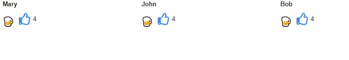
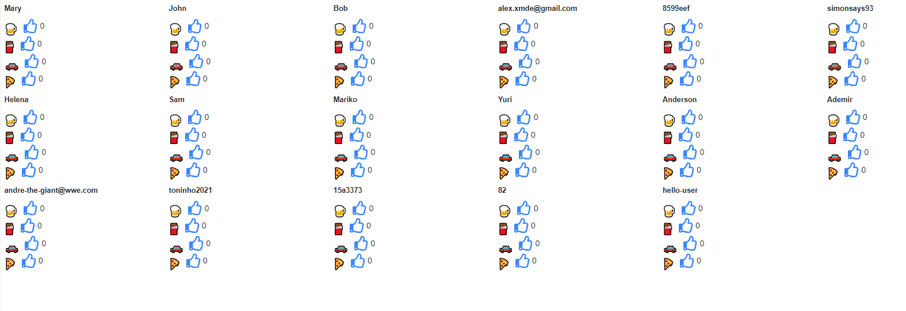

# Like Button MVP

A smart `<LikeButton>` React component that works out of the box!

# How to Use

The `<LikeButton>` component receives two parameters:

- topic: What is being liked
- user: Who is liking

```jsx
<LikeButton topic="brownies" user="Mary" />
```

The example above will display a like button, and automatically hook it up with a database to display the amount of people who likes brownies.
Also, if Mary has already liked brownies before, it will render filled.
Mary can also change her mind and click on the like button again, this time, decreasing the number of likes in the brownie topic.

# Live Update

Suppose that Mary likes brownie. And 1000 more people do.
Then, by default, in John's browser, the amount of likes will remain the same until he reloads the page.

The `<LikeButton>` has a property called `live`. Use it like this:

```jsx
<LikeButton topic="brownies" user="John" live />
```

And have the like count updated automatically in John's screen.
It updates the count for every user who has the `live` flag turned on

# See it in Action!





# Any Topic, Any User!

Both topic and user can be a username, an id, a hash, a page url...
You decide it. Just hand down the topic and user to the `<LikeButton>`, and the rest is with us.

# Running the Sandbox

```bash
git clone https://github.com/alexmachina/rock-like.git ~/rock-like
cd ~/rock-like
docker-compose up --build -d
```

open `localhost:3000` on your browser.

# Architecture

Both the front-end and the back-end are writter in TypeScript.
The back-end is a Node API, built with express server, integrated with a MongoDB database.
The front-end is written in React, using CRA.

### Front-end

Read more about the front-end [here](front-end/README.md)

### Back-end

Read more about the back-end [here](rest-api/README.md)

# Roadmap

Here are features that are important, but couldn't make it to the project yet.

### 1. Create npm package

### 2. Add a cache mechanism

- A good improvement would be to memcache the GET request for a couple of seconds.
- Also, find a way to queue updates to the database, in memory too, and then update the `users` array at once with multiple entries. That would reduce the number of operations in the mongo database.

### 3. Add unit tests to the back-end project

- It can be done with jest and shelf, spaning a mongodb instance in memory, and then testing the endpoints with supertest. https://jestjs.io/docs/en/mongodb

### 4. Add unit tests to the front-end project

- Add unit testing for the components and the hook
- Integration tests can be configured using https://github.com/mswjs/msw as a tool to take the API into account when writing the tests, without losing performance. And no need to mock module on API calls.

### 5. Improve security/authentication

- We're using the cors middleware, and allowing any origin. We can use the cors middleware, reading from a hosts allowlist, to restrict endpoint access to these known hosts only.

- In production, we can add a cloudflare in our layer, to prevent DDoS attacks and other malicious stuff

- Add apiKey authentication and trakcing

### 6. Add namespacing

- At the moment, we can't have two topics or two users from different contexts (e.g different customers or differente applications). Namespacing the records is a good thing to add.

### 7. Add theming

- It would be pretty welcoming if the like button's visuals could be customized.

### 8. Deploy to CDN and make it non-react dependant

- The `<LikeButton>` can have a version deployed that is deployed to a CDN and when required, embedded on an specific element on the page. By doint this, clients that don't use React and even non-developers can integrate the like button on their websites. A behavior similar to https://developers.facebook.com/docs/plugins/like-button/
